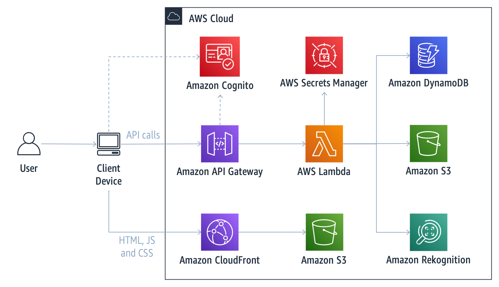

***Deprecation Notice*** - This AWS Solution has been archived and is no longer maintained by AWS. To discover other solutions, please visit the [AWS Solutions Library](https://aws.amazon.com/solutions).


# Liveness Detection Framework

The Liveness Detection Framework solution helps you implement liveness detection mechanisms into your applications by
means of an extensible architecture. This solution comprises a set of APIs to process and verify liveness challenges,
along with two different types of challenge provided as reference implementations. In addition to those, you can extend
the framework and implement your own liveness detection algorithm. The solution also includes a sample web application
fully integrated with the APIs. You can customize the sample web application or use it as a reference to create your own
front-end that fits your business needs.

## Architecture

Deploying this solution builds the following architecture in your AWS account:



The architecture is composed of a web application that serves as the user frontend, and a serverless backend with APIs
that are invoked by the frontend.

* **Client Device:** Device that enables the user to access the sample web application. The sample web application
  captures user images (frames) using the device embedded camera and invokes the solution APIs in the cloud.
* **Amazon CloudFront + Amazon S3:** The sample web application static files (HTML, JavaScript, and CSS) are hosted on
  Amazon S3 and served through an Amazon CloudFront distribution.
* **Amazon API Gateway:** Used to expose the REST/HTTP API endpoints invoked by the Client Device.
* **AWS Lambda:** Serverless compute service used to host the functions that serve the APIs.
* **Amazon DynamoDB:** Key-value database table that stores information about each user’s challenge attempts, such as
  user ID, timestamp, and challenge-related parameters.
* **Amazon S3:** Object storage bucket that holds user images captured by the Client Device and uploaded via the APIs.
* **Amazon Rekognition:** Deep learning-powered image recognition service used for identifying faces in an image along
  with their position and landmarks (eyes, nose, mouth, etc.).
* **AWS Secrets Manager:** Service that stores the secret used to sign tokens.
* **Amazon Cognito:** Service that provides user access control to the API calls.

> __NOTE:__ [face-api.js](https://github.com/justadudewhohacks/face-api.js) is used in the nose challenge in the web application to detect faces and landmarks on the browser to give real time user feedback as he/she performs the challenge. Liveness validation occurs in the backend, performed by __Rekognition only__. Results from the library are not used for any means of liveness validation.

For more details regarding the architecture, design considerations, and components, please refer to
the [Implementation guide](https://docs.aws.amazon.com/solutions/latest/liveness-detection-framework/).

## Getting Started

You can launch this solution with one click
from [AWS Solutions Implementations](https://aws.amazon.com/solutions/implementations/liveness-detection-framework/).

## Custom build / development

To customize the solution, or to contribute to the solution, follow the steps of one of the option below.

### Prerequisites

* Python 3.8
* Node.js 14
* npm >= 7
* AWS Credentials configured in your environment. Refer to
  [Configuration and credential file settings](https://docs.aws.amazon.com/cli/latest/userguide/cli-configure-files.html)
* AWS CLI. Refer to [Installing the AWS CLI](https://docs.aws.amazon.com/cli/latest/userguide/cli-chap-install.html)
* AWS Chalice. Refer to [AWS Chalice](https://github.com/aws/chalice)

Clone this git repository:

```
git clone https://github.com/aws-solutions/liveness-detection-framework
```

### Option 1: Single AWS CloudFormation template

Use this option if you want to generate a single AWS CloudFormation template like the one used to deploy with one click,
available
in [AWS Solutions Implementations](https://aws.amazon.com/solutions/implementations/liveness-detection-framework/).

Configure the bucket name of your target Amazon S3 distribution bucket. When creating and using buckets it is recommended to:
- Use randomized names or uuid as part of your bucket naming strategy.
- Ensure buckets are not public.
- Verify bucket ownership prior to uploading templates or code artifacts.

```
export DIST_OUTPUT_BUCKET=%%MY_BUCKET%%
```

Build the distributable assets:

```
cd deployment
chmod +x ./build-s3-dist.sh
./build-s3-dist.sh $DIST_OUTPUT_BUCKET liveness-detection-framework v1.0.0 --no-suffix
```

Upload the distributable assets to your Amazon S3 bucket:

```
aws s3 cp ./global-s3-assets/ s3://$DIST_OUTPUT_BUCKET/liveness-detection-framework/v1.0.0/ --recursive --acl bucket-owner-full-control
aws s3 cp ./regional-s3-assets/ s3://$DIST_OUTPUT_BUCKET/liveness-detection-framework/v1.0.0/ --recursive --acl bucket-owner-full-control
```

Deploy the AWS CloudFormation stack replacing `%%ADMIN_EMAIL%%` and `%%ADMIN_NAME%%` with the corresponding values:

```
aws cloudformation create-stack \
    --template-body file://global-s3-assets/liveness-detection-framework.template \
    --stack-name liveness \
    --capabilities CAPABILITY_IAM CAPABILITY_NAMED_IAM CAPABILITY_AUTO_EXPAND \
    --parameters ParameterKey=AdminEmail,ParameterValue=%%ADMIN_EMAIL%% ParameterKey=AdminName,ParameterValue=%%ADMIN_NAME%%
```

This will take a few minutes to complete, but once it’s done, use the following command to get the URL of the deployed
web application:

```
aws cloudformation describe-stacks --stack-name liveness \
    --query "Stacks[].Outputs[?OutputKey=='Url'][] | [0].OutputValue"
```

### Option 2: Backend and frontend independently

Use this option if you want to develop and deploy the backend and the frontend independently.

#### Backend

Go into the `source/backend/` directory.

First, deploy the Cognito AWS CloudFormation stack replacing `%%ADMIN_EMAIL%%` and `%%ADMIN_NAME%%` with the
corresponding values:

```
aws cloudformation deploy \
    --template-file cognito.yaml \
    --stack-name liveness-cognito \
    --capabilities CAPABILITY_IAM \
    --parameter-overrides AdminEmail=%%ADMIN_EMAIL%% AdminName=%%ADMIN_NAME%%
```

This will take a few minutes to complete, but once it’s done, the following outputs will be available:

- _CognitoUserPoolArn_
- _UserPoolId_
- _UserPoolWebClientId_

You'll need those outputs' values on the next steps. You can get an output value in the AWS Console, inside AWS
CloudFormation. Alternatively, you can use the CLI. The following example returns the value of the _CognitoUserPoolArn_
output:

```
aws cloudformation describe-stacks --stack-name liveness-cognito \
    --query "Stacks[].Outputs[?OutputKey=='CognitoUserPoolArn'][] | [0].OutputValue"
```

Open the `.chalice/config.json` file and add `COGNITO_USER_POOL_ARN` to the development environment variables with the
corresponding value from the output.

Run the following commands to generate the AWS Lambda deployment package and the AWS CloudFormation template:

```
python -m venv /tmp/venv
. /tmp/venv/bin/activate
pip install -r requirements.txt
chalice package --merge-template resources.yaml /tmp/packaged-app/
```

The command above creates a directory that contains two files: a `deployment.zip` file, which is the AWS Lambda
deployment package, and a `sam.json` file, which is the AWS CloudFormation template.

[Create an Amazon S3 bucket](https://docs.aws.amazon.com/AmazonS3/latest/userguide/create-bucket-overview.html) or use a
bucket you already own to place the AWS Lambda deployment package. When creating and using buckets it is recommended to:
- Use randomized names or uuid as part of your bucket naming strategy.
- Ensure buckets are not public.
- Verify bucket ownership prior to uploading templates or code artifacts.

Run the following command to upload the `deployment.zip` file to your bucket and update the AWS CloudFormation template
accordingly (replace `%%MY_BUCKET%%` with the corresponding value):

```
aws cloudformation package \
    --template-file /tmp/packaged-app/sam.yaml \
    --s3-bucket %%MY_BUCKET%% \
    --output-template-file /tmp/packaged-app/packaged.yaml
```

Now, deploy the AWS CloudFormation stack replacing `%%COGNITO_USER_POOL_ARN%%` with the corresponding value:

```
aws cloudformation deploy \
    --template-file /tmp/packaged-app/packaged.yaml \
    --stack-name liveness-backend \
    --capabilities CAPABILITY_IAM \
    --parameter-overrides CognitoUserPoolArn=%%COGNITO_USER_POOL_ARN%%
```

This will take a few minutes to complete, but once it’s done, the endpoint URL will be available as an output:

```
aws cloudformation describe-stacks --stack-name liveness-backend \
    --query "Stacks[].Outputs[?OutputKey=='EndpointURL'][] | [0].OutputValue"
```

Take note of the URL as it will be required in the frontend.

If you don't want to run the backend locally, jump to the next session to configure and deploy the frontend.

If you want to run the backend locally, first deploy both stacks so that the Amazon Cognito resources, Amazon S3 bucket,
the AWS DynamoDB table, and the AWS Secrets Manager secret are created in your account. Then, open
the `.chalice/config.json` file and add `REGION_NAME`, `BUCKET_NAME`, `TABLE_NAME`, `TOKEN_SECRET`, and `ACCOUNT_ID` to
the development environment variables (fill the values with the resources of the deployed CloudFormation stack).
Following is an example:

```
{
  "version": "2.0",
  "app_name": "liveness-backend",
  "lambda_functions": {
    "api_handler": {
      "lambda_timeout": 120,
      "lambda_memory_size": 512
    }
  },
  "stages": {
    "dev": {
      "api_gateway_stage": "dev",
      "environment_variables": {
        "COGNITO_USER_POOL_ARN": "the_user_pool_arn",
        "ACCOUNT_ID": "the_account_id",
        "REGION_NAME": "us-east-1",
        "BUCKET_NAME": "liveness-stackName-challengebucket-xyz",
        "TABLE_NAME": "liveness-stackName-ChallengeTable-xyz",
        "TOKEN_SECRET": "arn:aws:secretsmanager:us-east-1:the_account_id:secret:TokenSecret-xyz",
        "THREAD_POOL_SIZE": "10",
        "LOG_LEVEL": "DEBUG",
        "CLIENT_CHALLENGE_SELECTION": "True"
      }
    }
  }
}
```

After setting the configuration, run the backend locally with the following command:

```
chalice local
```

This command will simulate the functions and endpoints that will run under API Gateway after the stack is deployed.

#### Frontend

Go into the `source/client/` directory.

Download the ML models from [face-api.js library](https://github.com/justadudewhohacks/face-api.js):

```
curl -o public/weights/tiny_face_detector_model-shard1.shard -kL https://github.com/justadudewhohacks/face-api.js/blob/a86f011d72124e5fb93e59d5c4ab98f699dd5c9c/weights/tiny_face_detector_model-shard1?raw=true && \
    echo 'f3020debaf078347b5caaff4bf6dce2f379d20bc *public/weights/tiny_face_detector_model-shard1.shard' | shasum -c && \
    curl -o public/weights/tiny_face_detector_model-weights_manifest.json -kL https://github.com/justadudewhohacks/face-api.js/blob/a86f011d72124e5fb93e59d5c4ab98f699dd5c9c/weights/tiny_face_detector_model-weights_manifest.json?raw=true && \
    echo '1f9da0ddb847fcd512cb0511f6d6c90985d011e6 *public/weights/tiny_face_detector_model-weights_manifest.json' | shasum -c && \
    curl -o public/weights/face_landmark_68_model-shard1.shard -kL https://github.com/justadudewhohacks/face-api.js/blob/a86f011d72124e5fb93e59d5c4ab98f699dd5c9c/weights/face_landmark_68_model-shard1?raw=true && \
    echo 'e8b453a3ce2a66e6fa070d4e30cd4e91c911964b *public/weights/face_landmark_68_model-shard1.shard' | shasum -c && \
    curl -o public/weights/face_landmark_68_model-weights_manifest.json -kL https://github.com/justadudewhohacks/face-api.js/blob/a86f011d72124e5fb93e59d5c4ab98f699dd5c9c/weights/face_landmark_68_model-weights_manifest.json?raw=true && \
    echo 'a981c7adfc6366e7b51b6c83b3bb84961a9a4b15 *public/weights/face_landmark_68_model-weights_manifest.json' | shasum -c
```

Change the models' paths in the manifests:

```
perl -i -pe 's/tiny_face_detector_model-shard1/tiny_face_detector_model-shard1.shard/g' public/weights/tiny_face_detector_model-weights_manifest.json
perl -i -pe 's/face_landmark_68_model-shard1/face_landmark_68_model-shard1.shard/g' public/weights/face_landmark_68_model-weights_manifest.json
```

Open the `.env` file and replace the value of `REACT_APP_API_URL` with the endpoint URL of the backend. Also replace the
values of `REACT_APP_USER_POOL_ID` and `REACT_APP_USER_POOL_WEB_CLIENT_ID` with the values from the outputs of the AWS
Cognito stack and the value of `REACT_APP_AWS_REGION` with the name of the AWS region you're deploying to (example:
`us-east-1`).

Run the following command to install the package and its dependencies:

```
npm install
```

If you want to deploy the frontend, proceed to the next step. Otherwise, if you just want to run the frontend locally,
use the following command and skip the other steps:

```
npm run start
```

To deploy the frontend, it's necessary to build it and then upload its static files.

> __NOTE__: If you have configured the frontend locally, please adjust the `REACT_APP_API_URL` variable under the `.env` file. The variable should point to the backend endpoint url noted earlier.

To build, run the following
command:

```
npm run build
```

Run the following command to deploy the AWS CloudFormation stack:

```
aws cloudformation deploy \
    --template-file template.yaml \
    --stack-name liveness-client \
    --capabilities CAPABILITY_IAM
```

This will take a few minutes to complete, but once it’s done, the Amazon S3 bucket will be available as an output:

```
aws cloudformation describe-stacks --stack-name liveness-client \
    --query "Stacks[].Outputs[?OutputKey=='StaticWebsiteBucket'][] | [0].OutputValue"
```

Copy the static frontend files with the following command (replace `%%YOUR_BUCKET%%` with the `StaticWebsiteBucket`
output value from your AWS CloudFormation stack):

```
aws s3 cp build s3://%%YOUR_BUCKET%%/ --recursive
```

> __NOTE__: If it so happens that you deployed the frontend using the local endpoint url, re-run the steps above, making sure to adjust the `.env` file. After uploading the files, [invalidate the cach on CloudFront](https://docs.aws.amazon.com/AmazonCloudFront/latest/DeveloperGuide/Invalidation.html) before testing the application.

The web application URL is also available as an output of the AWS CloudFormation stack:

```
aws cloudformation describe-stacks --stack-name liveness-client \
    --query "Stacks[].Outputs[?OutputKey=='WebsiteURL'][] | [0].OutputValue"
```


## Clean up

If you don't want to continue using the solution, take the following steps to clean up its resources and avoid further
charges.

You can clean up by deleting the AWS CloudFormation stacks. You must manually delete the Amazon S3 buckets and Amazon
DynamoDB table as they are not automatically deleted.

### Deleting AWS CloudFormation stacks

1. Sign in to the [AWS CloudFormation console](https://console.aws.amazon.com/cloudformation).
2. On the **Stacks** page, select the backend stack (`liveness-backend`).
3. Choose **Delete**.
4. On the **Stacks** page, select the cognito stack (`liveness-cognito`).
5. Choose **Delete**.
6. On the **Stacks** page, select the client stack (`liveness-client`).
7. Choose **Delete**.

> __NOTE:__ If you deployed the solution using the single template, just delete the `liveness` stack instead.

### Deleting the Amazon S3 buckets

After deleting the stacks, you can manually delete the S3 buckets if you do not need to retain the data. Follow these
steps to delete the Amazon S3 buckets.

1. Sign in to the [Amazon S3 console](https://console.aws.amazon.com/s3).
2. Choose Buckets from the left navigation pane.
3. Locate the `<stack-name>-backend*-challengebucket-<id>` S3 bucket.
4. Select the S3 bucket and choose **Delete**.
5. Locate the `<stack-name>-backend*-loggingbucket-<id>` S3 bucket.
6. Select the S3 bucket and choose **Delete**.
7. Locate the `<stack-name>-backend*-trailbucket-<id>` S3 bucket.
8. Select the S3 bucket and choose **Delete**.
9. Locate the `<stack-name>-client*-staticwebsitebucket-<id>` S3 bucket.
10. Select the S3 bucket and choose **Delete**.
11. Locate the `<stack-name>-client*-loggingbucket-<id>` S3 bucket.
12. Select the S3 bucket and choose **Delete**.

> __NOTE:__ Before attempting to delete an Amazon S3 bucket, it must be empty.

To empty an Amazon S3 bucket, follow the steps below.

1. Sign in to the [Amazon S3 console](https://console.aws.amazon.com/s3).
2. Choose Buckets from the left navigation pane.
3. Locate the S3 bucket to empty.
4. Select the S3 bucket and choose **Empty**.

### Deleting the Amazon DynamoDB table

After deleting the stacks, you can manually delete the Amazon DynamoDB table if you do not need to retain the data.
Follow these steps to delete the Amazon DynamoDB table.

1. Sign in to the [Amazon DynamoDB console](https://console.aws.amazon.com/dynamodb).
2. Locate the `<stack-name>-BackendStack-<id>-ChallengeTable-<id>` table.
3. Select the table and choose **Delete** table.

## Collection of operational metrics

This solution collects anonymous operational metrics to help AWS improve the quality and features of the solution. For
more information, including how to disable this capability, please refer to
the [Implementation guide](https://docs.aws.amazon.com/solutions/latest/liveness-detection-framework/).

## License

This project is licensed under the Apache-2.0 License.

***

Liveness Detection Framework makes use of Amazon Rekognition service. Customers should be aware
about [Use cases that involve public safety](https://docs.aws.amazon.com/rekognition/latest/dg/considerations-public-safety-use-cases.html)
and the general [AWS Service Terms](https://aws.amazon.com/service-terms/).
